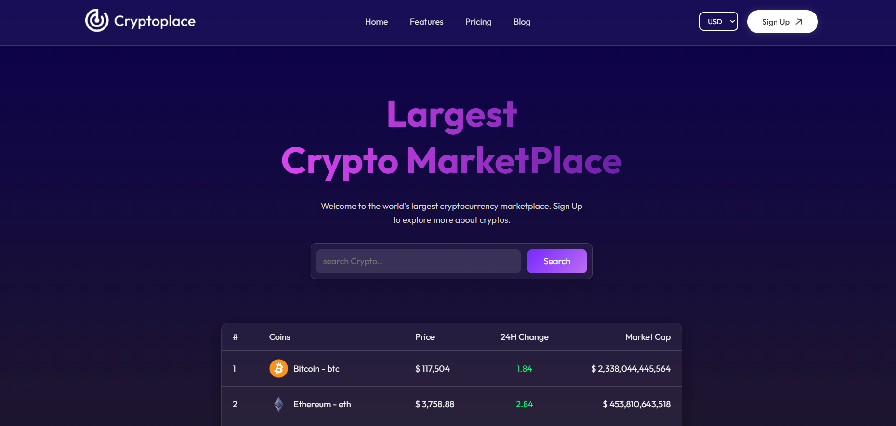
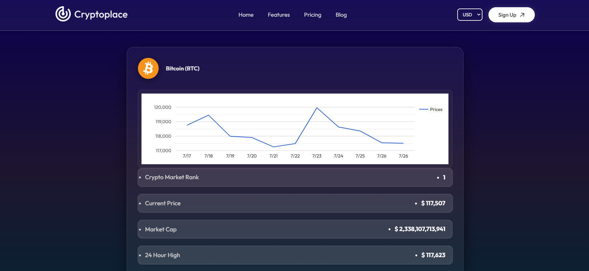

# 🪙 CryptoTracker — Mini React Crypto App using CoinGecko API

A **responsive cryptocurrency market dashboard** built with **React** that fetches real-time data using the [CoinGecko API](https://www.coingecko.com/en/api). The goal of this mini-project was to learn how to integrate third-party APIs, manage data with React hooks, and build responsive UI with clean design.

---

## 📸 Screenshots

### 🏠 Home Page



### 📊 Coin Detail Page



> _(Place both `homepage.png` and `coin-detail.png` inside a folder called `assets/` in your repo)_

---

## 🚀 Features

- 🔄 Real-time crypto price tracking using CoinGecko API
- 📊 Price charts with historical data visualization
- 🔍 Search functionality to find any cryptocurrency
- 📱 Fully responsive layout for all devices
- ⚛️ React Hooks: `useState`, `useEffect` for state/data management
- 🌙 Clean and modern dark UI

---

## 🛠️ Tech Stack

| Tech                 | Purpose                    |
| -------------------- | -------------------------- |
| React                | Frontend UI                |
| CoinGecko API        | Live crypto data source    |
| Chart.js or Recharts | Coin price graphing        |
| CSS / Tailwind CSS   | Styling and responsiveness |

---

## 📂 Project Structure

src/
│
├── components/ # Reusable components like Navbar, CryptoCard, Chart
├── pages/ # Home page, Coin detail page
├── context/ # API handler (CoinGecko integration)
├── App.jsx # Root component
├── index.js # Entry point
└── assets/ # Screenshots and visual assets


---

## 🧠 What I Learned

- How to fetch and display live data from a REST API
- Managing async calls and updating state dynamically
- Building reusable components for consistency
- Structuring a React project effectively
- Designing for responsiveness and accessibility

---

## 🔗 CoinGecko API Endpoint

This app uses the `/coins/markets` endpoint:
```bash
GET https://api.coingecko.com/api/v3/coins/markets?vs_currency=usd&order=market_cap_desc&per_page=10&page=1&sparkline=false


# 1. Clone the repository
git clone https://github.com/stud-manasbiswas/Crypto-MarketPlace-React.git

# 2. Navigate into the project directory
cd Crypto-MarketPlace-React

# 3. Install all dependencies
npm install
# or
yarn install

# 4. Start the development server
npm run dev
# or
yarn dev

